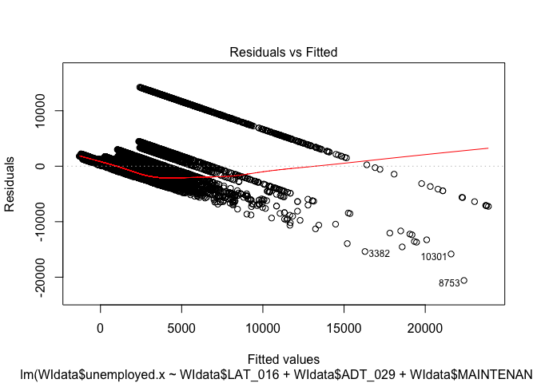
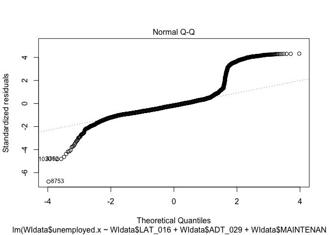
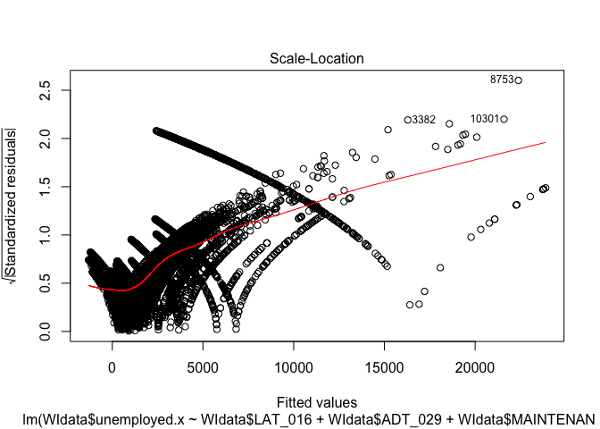
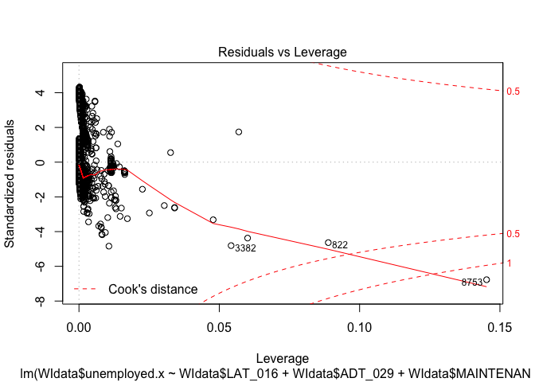
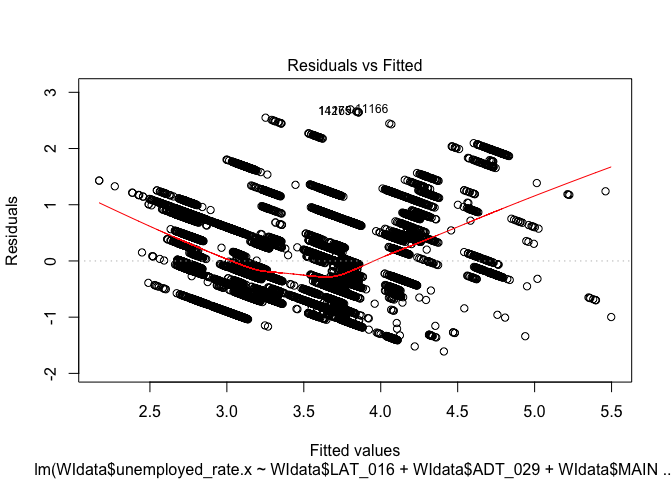
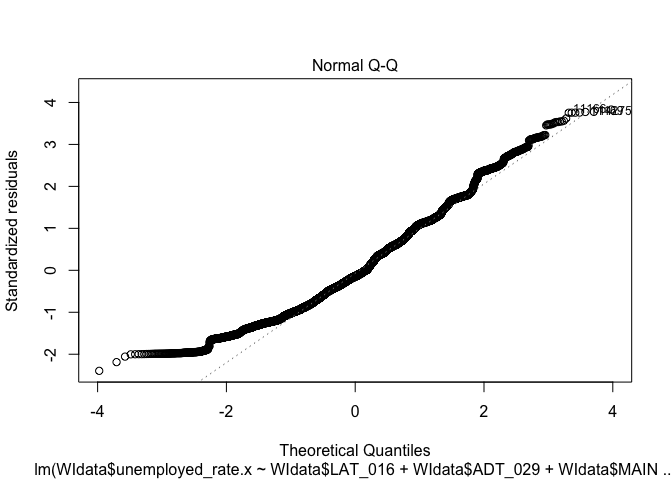
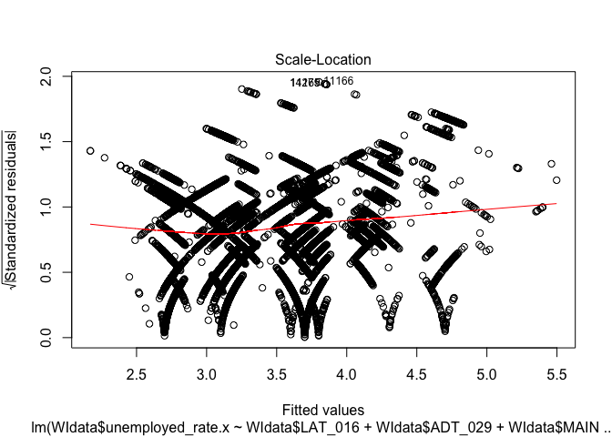
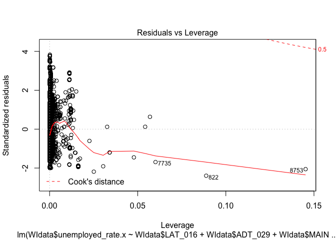

Importing the data
==================

\#I am insterested in the relationship between WI’s bridge data and WI’s
unempolyment rate.

\#Importing the WI’s unemployment rate data

    library(dplyr)

    ## 
    ## Attaching package: 'dplyr'

    ## The following objects are masked from 'package:stats':
    ## 
    ##     filter, lag

    ## The following objects are masked from 'package:base':
    ## 
    ##     intersect, setdiff, setequal, union

    library(blscrapeR)

    ## Warning: package 'blscrapeR' was built under R version 3.5.2

    df <- get_bls_county()
    WIunemployment = df %>% filter(fips_state == 55)
    WINov = get_bls_county("November 2019", "Wisconsin")

\#Importing the WI’s bridge data

    library(data.table)

    ## 
    ## Attaching package: 'data.table'

    ## The following objects are masked from 'package:dplyr':
    ## 
    ##     between, first, last

    WI2018<- fread("https://www.fhwa.dot.gov/bridge/nbi/2018/delimited/WI18.txt")

Combine the two data
--------------------

    library(ggplot2)

    WIunemployment = WIunemployment %>% mutate(fips_county=as.integer(fips_county))
    WINov = WINov %>% mutate(fips_county=as.integer(fips_county))

    WIdata = WI2018%>% 
      left_join(WIunemployment,by = c("COUNTY_CODE_003" = "fips_county")) %>% 
      left_join(WINov,by = c("COUNTY_CODE_003" = "fips_county")) 

Fit the model
-------------

\#Fit a linear model to predict the number of unemployed.

    unemployment <- lm(WIdata$unemployed.x
                         ~ WIdata$LAT_016 + WIdata$ADT_029 + WIdata$MAINTENANCE_021 + 
                         WIdata$MAIN_UNIT_SPANS_045+ WIdata$TOTAL_IMP_COST_096 )
    summary(unemployment)

    ## 
    ## Call:
    ## lm(formula = WIdata$unemployed.x ~ WIdata$LAT_016 + WIdata$ADT_029 + 
    ##     WIdata$MAINTENANCE_021 + WIdata$MAIN_UNIT_SPANS_045 + WIdata$TOTAL_IMP_COST_096)
    ## 
    ## Residuals:
    ##      Min       1Q   Median       3Q      Max 
    ## -20591.1  -1725.1   -568.2    660.2  14234.5 
    ## 
    ## Coefficients:
    ##                              Estimate Std. Error t value Pr(>|t|)    
    ## (Intercept)                 4.937e+04  1.264e+03  39.047   <2e-16 ***
    ## WIdata$LAT_016             -1.094e-03  2.876e-05 -38.047   <2e-16 ***
    ## WIdata$ADT_029              1.332e-01  2.562e-03  51.994   <2e-16 ***
    ## WIdata$MAINTENANCE_021      1.332e+01  5.863e+00   2.272   0.0231 *  
    ## WIdata$MAIN_UNIT_SPANS_045  1.661e+02  2.020e+01   8.223   <2e-16 ***
    ## WIdata$TOTAL_IMP_COST_096   6.056e-01  4.542e-02  13.334   <2e-16 ***
    ## ---
    ## Signif. codes:  0 '***' 0.001 '**' 0.01 '*' 0.05 '.' 0.1 ' ' 1
    ## 
    ## Residual standard error: 3289 on 14221 degrees of freedom
    ##   (48 observations deleted due to missingness)
    ## Multiple R-squared:  0.3062, Adjusted R-squared:  0.3059 
    ## F-statistic:  1255 on 5 and 14221 DF,  p-value: < 2.2e-16

    plot(unemployment)

\#The model shows that : the variable “Average Daily Traffic”,
“Maintenance Responsibility”, “Number of Spans in Main Unit” and “Total
Project Cost” is postively correlated with the unemployment rate in
Wisconsin while the “latitude” is negativly correlated with the
unemployment rate. These independent variables are all stastically
significant.

\#Fit another model to predict the unemployment rate.

    rate<- lm(WIdata$unemployed_rate.x ~ WIdata$LAT_016 + WIdata$ADT_029 + WIdata$MAINTENANCE_021 + 
                         WIdata$MAIN_UNIT_SPANS_045+ WIdata$TOTAL_IMP_COST_096)

    summary(rate)

    ## 
    ## Call:
    ## lm(formula = WIdata$unemployed_rate.x ~ WIdata$LAT_016 + WIdata$ADT_029 + 
    ##     WIdata$MAINTENANCE_021 + WIdata$MAIN_UNIT_SPANS_045 + WIdata$TOTAL_IMP_COST_096)
    ## 
    ## Residuals:
    ##     Min      1Q  Median      3Q     Max 
    ## -1.6104 -0.5553 -0.1015  0.4560  2.6972 
    ## 
    ## Coefficients:
    ##                              Estimate Std. Error t value Pr(>|t|)    
    ## (Intercept)                -1.880e+01  2.707e-01 -69.452  < 2e-16 ***
    ## WIdata$LAT_016              5.073e-07  6.157e-09  82.403  < 2e-16 ***
    ## WIdata$ADT_029             -4.245e-06  5.484e-07  -7.740 1.06e-14 ***
    ## WIdata$MAINTENANCE_021      1.071e-02  1.255e-03   8.531  < 2e-16 ***
    ## WIdata$MAIN_UNIT_SPANS_045  3.951e-03  4.324e-03   0.914  0.36089    
    ## WIdata$TOTAL_IMP_COST_096   3.141e-05  9.724e-06   3.230  0.00124 ** 
    ## ---
    ## Signif. codes:  0 '***' 0.001 '**' 0.01 '*' 0.05 '.' 0.1 ' ' 1
    ## 
    ## Residual standard error: 0.7041 on 14221 degrees of freedom
    ##   (48 observations deleted due to missingness)
    ## Multiple R-squared:  0.3472, Adjusted R-squared:  0.347 
    ## F-statistic:  1513 on 5 and 14221 DF,  p-value: < 2.2e-16

    plot(rate)

\#The model shows that : the variable “latitude”, “Maintenance
Responsibility”, “Number of Spans in Main Unit” and “Total Project Cost”
is postively correlated with the unemployment rate in Wisconsin while
the “Average Daily Traffic” is negativly correlated with the
unemployment rate. These independent variables are stastically
significant except the variable “Number of Spans in Main Unit”.

\#Use the unemployed number and rate from the previous month as
additional predictors

    unemploymentNew <- lm(WIdata$unemployed.x
                         ~ WIdata$unemployed.y
                           + WIdata$LAT_016 + WIdata$ADT_029 + WIdata$MAINTENANCE_021 + 
                         WIdata$MAIN_UNIT_SPANS_045+ WIdata$TOTAL_IMP_COST_096 )
    summary(unemploymentNew)

    ## 
    ## Call:
    ## lm(formula = WIdata$unemployed.x ~ WIdata$unemployed.y + WIdata$LAT_016 + 
    ##     WIdata$ADT_029 + WIdata$MAINTENANCE_021 + WIdata$MAIN_UNIT_SPANS_045 + 
    ##     WIdata$TOTAL_IMP_COST_096)
    ## 
    ## Residuals:
    ##     Min      1Q  Median      3Q     Max 
    ## -264.28  -61.53   -3.72   43.39  368.21 
    ## 
    ## Coefficients:
    ##                              Estimate Std. Error  t value Pr(>|t|)    
    ## (Intercept)                -1.522e+03  4.080e+01  -37.319   <2e-16 ***
    ## WIdata$unemployed.y         9.543e-01  2.448e-04 3899.000   <2e-16 ***
    ## WIdata$LAT_016              3.912e-05  9.260e-07   42.251   <2e-16 ***
    ## WIdata$ADT_029              7.437e-04  8.536e-05    8.712   <2e-16 ***
    ## WIdata$MAINTENANCE_021     -2.156e+00  1.793e-01  -12.026   <2e-16 ***
    ## WIdata$MAIN_UNIT_SPANS_045  4.204e-01  6.190e-01    0.679    0.497    
    ## WIdata$TOTAL_IMP_COST_096  -9.051e-04  1.397e-03   -0.648    0.517    
    ## ---
    ## Signif. codes:  0 '***' 0.001 '**' 0.01 '*' 0.05 '.' 0.1 ' ' 1
    ## 
    ## Residual standard error: 100.5 on 14220 degrees of freedom
    ##   (48 observations deleted due to missingness)
    ## Multiple R-squared:  0.9994, Adjusted R-squared:  0.9994 
    ## F-statistic: 3.653e+06 on 6 and 14220 DF,  p-value: < 2.2e-16

    plot(unemploymentNew)

\#After adding the unemployed number from the previous month as
additional predictor, the new model shows that : the variable “Old
unemployed number”,“Latitude”, “Average Daily Traffic” and “Number of
Spans in Main Unit” is postively correlated with the unemployment rate
in Wisconsin while the “Maintenance Responsibility” and “Total Project
Cost” is negativly correlated with the unemployment rate. And among
thses predictors, “Maintenance Responsibility” and “Total Project Cost”
are not stastically significant.

    rateNew <- lm(WIdata$unemployed_rate.x ~ WIdata$unemployed_rate.y + 
                    WIdata$LAT_016 + WIdata$ADT_029 + WIdata$MAINTENANCE_021 + 
                         WIdata$MAIN_UNIT_SPANS_045+ WIdata$TOTAL_IMP_COST_096)

    summary(rateNew)

    ## 
    ## Call:
    ## lm(formula = WIdata$unemployed_rate.x ~ WIdata$unemployed_rate.y + 
    ##     WIdata$LAT_016 + WIdata$ADT_029 + WIdata$MAINTENANCE_021 + 
    ##     WIdata$MAIN_UNIT_SPANS_045 + WIdata$TOTAL_IMP_COST_096)
    ## 
    ## Residuals:
    ##     Min      1Q  Median      3Q     Max 
    ## -1.9785 -0.2684 -0.0377  0.2026  1.0876 
    ## 
    ## Coefficients:
    ##                              Estimate Std. Error t value Pr(>|t|)    
    ## (Intercept)                -1.029e+01  1.513e-01 -68.045  < 2e-16 ***
    ## WIdata$unemployed_rate.y    1.071e+00  5.665e-03 188.989  < 2e-16 ***
    ## WIdata$LAT_016              2.439e-07  3.569e-09  68.340  < 2e-16 ***
    ## WIdata$ADT_029             -9.312e-06  2.939e-07 -31.687  < 2e-16 ***
    ## WIdata$MAINTENANCE_021     -7.263e-03  6.766e-04 -10.735  < 2e-16 ***
    ## WIdata$MAIN_UNIT_SPANS_045 -1.035e-02  2.309e-03  -4.484 7.40e-06 ***
    ## WIdata$TOTAL_IMP_COST_096  -2.066e-05  5.196e-06  -3.976 7.03e-05 ***
    ## ---
    ## Signif. codes:  0 '***' 0.001 '**' 0.01 '*' 0.05 '.' 0.1 ' ' 1
    ## 
    ## Residual standard error: 0.3758 on 14220 degrees of freedom
    ##   (48 observations deleted due to missingness)
    ## Multiple R-squared:  0.8141, Adjusted R-squared:  0.814 
    ## F-statistic: 1.038e+04 on 6 and 14220 DF,  p-value: < 2.2e-16

    plot(rateNew)

\#In this new model, only the variable “unemployement rate from last
month” and “Latitude” are postively correlated with the unemployment
rate in Wisconsin while other predictors are all negativly correlated
with the unemployment rate. These independent variables are all
stastically significant.
